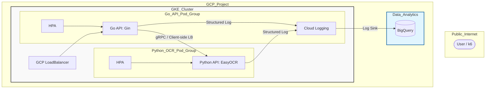

# 1.はじめに
Go言語による高速なAPI受付と、PythonのEasyOCRエンジンをgRPCで繋ぐ、スケーラブルなOCRバックエンド基盤を構築しました。本記事では、そのアーキテクチャの構築ポイントを解説します。
今回の設計の核は、Google Kubernetes Engine（GKE）上での**サイドカー構成**の採用です。並行処理に強いGoと、MLライブラリが豊富なPythonを1つのPodに同居させつつ、リソース制限（Requests/Limits）を厳密に分離しました。これにより、EasyOCRという重量級ワークロードを、他の処理を妨げることなくクラウドネイティブに「並列化・スケール」させる構成を実現しています。

なお、本記事は3部構成の「ポイント解説編」となります。
**・具体的な実装・コードについては：** [詳細説明編]（リンク）
**・負荷試験とスケーリングの実証結果については：** [検証編]（リンク）
検証編では、高負荷環境下でのレイテンシ推移や、BigQueryを用いた詳細なパフォーマンス分析も実施しています。


| ◆構成 |
|:---------------|
|[1.はじめに](#1はじめに) |
|[2.技術スタックとシステム構成](#2技術スタックとシステム構成)|
|[3.ポイント①:OCR基盤の構築(EasyOCR on K8s)](#3ポイントocr基盤の構築easyocr-on-k8s)|
|[4.ポイント②:サイドカー構成(Go & Python の共存)](#4ポイントサイドカー構成go--python-の共存)
|[5.ポイント③:観測性の仕込み(Cloud Logging と分析基盤）](#5ポイント観測性の仕込みcloud-logging-と分析基盤)
|[6.ポイント④:GKEによるコンピューティングの並列化](#6ポイントgkeによるコンピューティングの並列化)
|[7.おわりに](#7おわりに)|


# 2.技術スタックとシステム構成

## 2-1. 技術スタック

本システムでは、以下の技術スタックを採用しています。


| カテゴリ | 技術・ツール | 用途 |
| :--- | :--- | :--- |
| **Frontend API** | **Go (Gin)** | HTTPリクエスト受付、gRPCクライアント、構造化ログ出力 |
| **Inference Engine** | **Python (EasyOCR)** | gRPCサーバー、EasyOCRによる文字認識処理 |
| **Communication** | **gRPC / Protocol Buffers** | Go-Python間の高速・型安全なマイクロサービス通信 |
| **Infrastructure** | **GKE (Standard)** | コンテナオーケストレーション、HPAによるオートスケーリング |
| **IaC** | **Terraform** | VPC, GKE, Artifact Registry, Log Sinkのコード管理 |
| **Observability** | **Cloud Logging / BigQuery** | 構造化ログの集約、およびSQLによる推論精度・性能分析 |
| **Testing** | **k6** | 期待値（正解データ）を用いた高負荷・精度検証試験 |


### 2-2. 主要ライブラリ
特に注目すべき採用ライブラリは以下の通りです。

| 対象 | ライブラリ | 採用理由 |
| :--- | :--- | :--- |
| **Go** | **Gin** | 軽量かつ高速で、構造化ログとの相性が良いため。 |
| **Go** | **gopsutil** | Pod内のリソース使用率をログに含め、分析に活用するため。 |
| **Python** | **EasyOCR** | PyTorchベースで精度が高く、日本語・英語に標準対応しているため。 |
| **Python** | **psutil** | 推論時のCPU負荷を正確に計測し、ログ出力するため。 |
| **Common** | **gRPC** | HTTP/1.1よりも低遅延で、双方向通信やストリーミングにも対応可能なため。 |


## 2-3. ディレクトリ構成
インフラ管理（Terraform）コマンドで、デプロイできる以下の構成となっています。
このデータセットは、[GitHubレポジトリ](https://github.com/wata123-t/go-python-easyocr-gke) に登録しています。


```text
.
├── terraform/          # GKE, VPC, Artifact Registry, Log Sinkの定義
├── chart/              # Kubernetesデプロイ用リソース (Helm Chart形式)
│   └── templates/      # Deployment, Service, HPA, RBACのマニフェスト
├── go-api/             # フロントエンドAPI (Go / Gin)
├── python-api/         # 推論エンジン (Python / EasyOCR / gRPC Server)
├── pb/                 # gRPC定義ファイル (.proto) と自動生成コード
└── k6/                 # 負荷試験スクリプト
    └── test_images/    # 検証用画像および正解データ(mapping.json)
```

## 2-3. システム構成
本プロジェクトは、設計・検証・分析の各工程を GitHub Actions で統合しています。全体のデータの流れと、各記事の解説範囲は以下の通りです。


### <ins>_◆関係記事_</ins>

本記事は、以下の内容にも関連しています。

**・1.[【ハード・ソフト協調検証①】Verilog HDLによる暗号化回路(AES-128)の設計](https://qiita.com/watapy/items/cc216b77695b3435f2f5)**


# 3.ポイント①:OCR基盤の構築(EasyOCR on K8s)
本システムの核となる推論エンジンには、日本語・英語に対応した EasyOCR を採用しました。MLモデルをコンテナ化し、K8s上で安定稼働させるために不可欠な「ロード戦略」と「リソース設計」のポイントを解説します。

## 3-1.モデルのライフサイクル管理（ホットスタンバイ）
EasyOCRのモデルロードは重く、リクエストごとに行うとレスポンスが数秒遅延します。これを防ぐため、 **「起動時に1回だけロードし、メモリ上に常駐させる」** 設計にしました。

```python
# グローバルスコープでロード（起動時に1回だけ実行）
# Podを「リクエスト受信後、即座に推論開始できる状態」で待機させる
print(f"[{POD_NAME}] Loading EasyOCR Reader...")
reader = easyocr.Reader(['en', 'ja'], gpu=False)

class Predictor(pb2_grpc.PredictorServicer):
    def Predict(self, request, context):
        # 既にロード済みのreaderを再利用
        ocr_results = reader.readtext(img_np, detail=1)
```

## 3-2.OOM(メモリ不足)を防ぐコンテナ設計（Helm）
OCR処理はCPUとメモリを激しく消費します。特にメモリ不足による OOM (Out Of Memory) Kill を防ぐため、実測に基づいたリソース制限（Limit）を設定しています。Memory Requests (1Gi): EasyOCRがモデルを展開し、安定して動作するための「最低保証ライン」です。Memory Limits (2Gi): 高解像度の画像処理やリクエストが重なった際のスパイクを許容し、Podの強制終了を防ぎます。

```python
python:
  resources:
    requests:
      cpu: "1000m"    # 推論をスムーズにするための最低ライン
      memory: "1Gi"  # EasyOCRモデル展開用に最低1GBを確保
    limits:
      cpu: "1000m"   # 1コアまで解放
      memory: "2Gi"  # 複数の推論が重なった際のバッファとして2GBを設定

```
## 3-3.アプリの要求に応えるインフラ設計（Terraform）
アプリ側で「1コア/2GB」というリソースを要求するため、インフラ（GKE）側もそれを受け止められるスペックで構成しています。
**・マシンタイプの選定 (e2-standard-2):** 1ノードあたり 2CPU / 8GBメモリ を確保。
**・オートスケーリング設定:** 最大6ノードまで拡張可能にすることで、1ノードに収まりきらない負荷（Podの増大）が発生しても、インフラ側が自動で土台を広げる柔軟性を持たせています。

```terraform
      cpu: "1000m"   # 1コアまで解放
      memory: "2Gi"  # 複数の推論が重なった際のバッファとして2GBを設定

```

## 3-4.実装における最適化ポイント

**・モデルのプリロード:** Predict メソッドの外で初期化することで、ウォームアップ時間を排除し、エンドツーエンドのレイテンシを最小化しました。

**・CPU推論の最適化:** 今回は汎用性を重視し gpu=False（CPU推論）としていますが、GKEのノード設定と合わせて limits を調整することで、コストパフォーマンスを最大化しています。

**・ダウンタイムのないスケール:**  重いモデルを持つPodだからこそ、個々のPodに十分なリソースを与えつつ、足りなくなればノードごと増やすという「階層的なスケーリング」を前提とした設計にしています。


# 4.ポイント②:サイドカー構成(Go & Python の共存)
本システムでは、API受付を Go、推論ロジックを Python と役割を完全に分離し、1つのPodに同居させる「サイドカー構成」を採用しました。


## 4-1.言語の特性を活かした「適材適所」の設計
なぜ一つの言語にまとめず、あえて複雑な2コンテナ構成にしたのか。その理由は **「責務の分離」** にあります。

**・Go (Main Container):** 軽量で並行処理に優れ、高速なHTTPレスポンスとログの集約を担当。
**・Python (Sidecar Container):** 豊富な機械学習ライブラリ（EasyOCR / PyTorch）を活用し、推論ロジックに特化。
**・メリット:** 推論エンジンのライブラリが巨大になっても、Go側のAPIロジックは常にクリーンで軽量な状態を維持でき、ビルド時間や起動速度の悪化を防げます


## 4-2.ネットワーク遅延を極小化する gRPC × localhost

コンテナを分ける際の最大の懸念は「通信オーバーヘッド」です。これを解決するために、**gRPC** と **Pod内通信** を組み合わせました。
**・localhost通信:** サイドカー構成では、コンテナ間通信が外部ネットワークを経由せず localhost で完結します。
**・バイナリ転送:** gRPC（Protocol Buffers）を採用することで、重い画像データもシリアライズの負荷を最小限に抑えたまま、高速に転送可能です。

```golang:./pb/predict.proto
# localhost:50051 で待ち受け。外部には公開せずPod内のみで通信。
server.add_insecure_port('[::]:50051')
```
## 4-3.リソースの「共倒れ」を防ぐ独立制限
一つのプロセスでGoとPythonを動かさない最大の利点は、 **「推論側のスパイクがAPI側に波及しない」** ことです。
**・リソースの防波堤:** PythonコンテナがOCR処理でCPUを100%使い切っても、Goコンテナには個別のCPU枠が割り当てられているため、APIのヘルスチェックや他のリクエスト受付が止まることはありません。
**・障害の孤立化:** 万が一Python側がメモリ不足（OOM）でクラッシュしても、Go側でそれを検知し、適切なエラーレスポンスを返す「粘り強い」システムを実現しています。


## 4-4. サイドカー運用のポイント
**・Connection Persistence:** サイドカー間は1対1の関係が固定されているため、gRPCの接続をあえて切らずに使い回す（max_connection_age_ms: 0）設定を入れ、接続確立のレイテンシすらも削ぎ落としています。
**・環境変数による疎結合:** Go側から見た推論サーバーのアドレスは、Helm経由で環境変数として注入。コードを変更せずに接続先を柔軟に変更できる構成にしています。


# 5.ポイント③:観測性の仕込み(Cloud Logging と分析基盤）
「動かして終わり」にせず、システムの健康状態や推論の精度を常に可視化できるよう、オブザーバビリティ（観測性）を設計しました。単なるテキストログではなく、BigQueryでの分析を前提とした「ログ・パイプライン」の構築ポイントを解説します。

## 5-1.処理を横断的に追跡する「Correlation ID」
分散システムでは、一つのリクエストが複数のコンテナ（Go → Python）を跨ぐため、処理を追跡する共通の「目印」が必要です。本システムでは request_id を伝搬させ、処理の全行程を一気通貫で追えるようにしています。

**・Go（入口）:** ユニークなIDを抽出し、gRPCのメタデータ（ヘッダー）にセット。
**・Python（推論）:** メタデータからIDを抽出し、自身のログに付与して出力。
**・効果:** Cloud Logging上でID検索するだけで、APIの受付からOCR完了までを数秒で特定できます。


## 5-2.分析を加速させる構造化ログ（JSON）
ログを単なるテキスト（String）ではなく、**構造化データ（JSON）** として標準出力します。これをGKEが自動回収することで、Cloud Logging上では最初から各項目が「検索可能なフィールド」として扱われます。

**・独自メトリクスの埋め込み:** 実行時間（duration_ms）やアプリ側で計測した cpu_usage をログに含めることで、特別な監視ツールを導入せずともパフォーマンス解析が可能になります。

**・運用コストの削減:** Fluentbit等のエージェント設定をいじることなく、アプリがJSONを出すだけでGCPの強力な分析機能と連携できます。


## 5-3.Log Sink による「ログの資産化」
Cloud Loggingに届いたログは、**Log Sink機能** を用いてリアルタイムでBigQueryへ転送しています。

**・長期保存:** Cloud Loggingの保持期間を気にせずログを蓄積。
**・高度な分析:** SQLを用いて「Podごとの平均処理時間」や「特定の画像に対する正解率」を即座に集計可能。

**・長期保存と低コスト:** Cloud Loggingの保持期限（通常30日）を気にせず、過去のデータを安価に蓄積。

**・SQLによる高度な分析:**
「特定のPodだけ処理が遅くないか？」
「画像のサイズと処理時間の相関は？」
といった複雑な分析が、SQL一発で即座に集計可能になります。

# 6.ポイント④:GKEによるコンピューティングの並列化
OCRのような計算リソースを大量に消費する処理を、遅延なく大量に捌くためには、アプリケーションの設計だけでなくインフラ側の「横方向の拡張性（スケーラビリティ）」が不可欠です。

## 6-1. Pod単体のスループット向上（並列性の確保）
1つのPod内に、あえて複数のgRPCワーカー（max_workers=3）を配置しています。
**・リソースの使い切り:** 推論処理がCPUを待っている間に、別のリクエストの受付や画像デコードを並行して行うことで、1コアという制限下でもPod単体の稼働率を最大化させています。

## 6-2. ノードプールの動的拡張（Cluster Autoscaler）

個々のPodの限界を超えた負荷に対しては、GKEのクラスターオートスケーラーが威力を発揮します。
**・自動的な「土台」の増設:** 負荷増大によりPodを増やそうとした際、ノード（マシン）のリソースが足りなければ、Terraformで定義した通り最大6台までノードが自動で追加されます。
**・計算資源のオンデマンド化:** OCRリクエストが多い時だけ計算資源を増やし、夜間などのアイドル時には最小構成（1台）に戻るため、ハイパフォーマンスと低コストを両立しています。


## 6-3. スループットを最大化する負荷分散

GKE上のService（LoadBalancer）が、複数のノードに散らばったPod群へリクエストを均等に振り分けます。
**・水平分散:** 「1つの強力なサーバー」を作るのではなく、「適度なサイズのPod」を複数並べることで、一部の推論が重くなってもシステム全体が停止しない「障害に強い並列構造」を実現しました。
**・gRPCの負荷分散:** サイドカー構成により、Go APIからPythonへの通信はPod内で完結しているため、外部のロードバランサーはGo API側の負荷（HTTP層）だけを気にすれば良いシンプルな構造になっています。


## 6-4. パフォーマンス検証：k6による負荷注入
設計の正しさを証明するため、負荷試験ツール k6 を用いて並列リクエストを注入しました。
**・検証の狙い:** 同時接続数を増やした際に、GKEの各ノードのCPUが期待通りに稼働し、リクエストが詰まることなく処理されるかをログベースで確認。
**・結果の可視化:** BigQueryに蓄積されたログから、並列実行時の「1秒あたりの処理完了数（TPS）」を算出し、インフラの増強がダイレクトに処理能力の向上に繋がっていることを確認しました

# 7.おわりに
本記事では、GoとPython、そしてGKEを組み合わせた **「実戦的なOCR基盤」** の構築のポイントを解説しました。
今回は、単に文字認識を行うだけでなく、以下の事を意識した設計となっています。
**・gRPC**によるマイクロサービス間の高速通信
**・Terraform**によるコードベースのインフラ管理
**・OCR処理の高速並列化** をマルチPod展開によって実現
**・BigQuery**を見据えた構造化ログの設計

構築基盤に関する検証を**【検証編】**では行っていますので、ぜひ、そちらもご参照ください。


